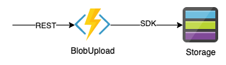
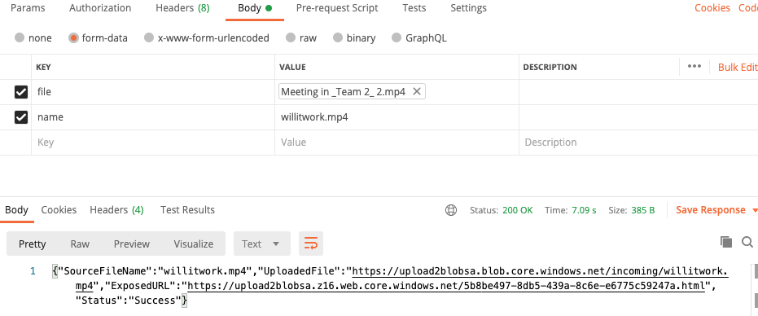

# BlobUpload
This repo illustrate how can Azure function used to upload content to specific blob storage & to trigger another function which will create a wrapping html5 page which can then be used as part of a static web-site.

## High level diagram


## Required Components
This example assume you have already provisioned:
- Storage account
- Function App
Once provision, create a container.


## Function

### Upload2Blob
The function is a http trigger function, it expects two parameters as post parameters:
- name - the name of the file to be uploaded (can differ from the actual file name)
- file - required to be passed as form data __File__ type

Successful calls will result in `200` and JSON message confirming the upload to the specific container. and the exposed url.
Unsuccessful calls will result in specific JSON response with specific error messages

#### Method :: Expose2Web
The method is called with the new uploaded file uri, it will create a simple _html_ page, with link to the file landing in the specific container (same container as in the `Upload2Blob` function).
The current code is supporting __hard coded__ `mp4` file types, feel free to enhance it.

It will use the `template.txt` template file which is stored in another container, replace the uri of the file:
```
<video width="320" height="240" controls>
  <source src="video_url_to_replace" type="video/mp4">
</video>
```
With the location of the uploaded file. 

**Tip** Need to worry about access control: in my solution I generated SAS token for the container, store it in the function configuration.


## Deployment

Clone this repo to your local machine. 
Change/create the local.setting.json with:

```
{
    "IsEncrypted": false,
    "Values": {
        "AzureWebJobsStorage": "<your function storage connection string>",
        "FUNCTIONS_WORKER_RUNTIME": "dotnet",
        "LANDING_CONTAINER": "<your container name>",
        "STORAGE": "<your designated storage connection string>",
        "CONTENT": "$web",
        "TEMPLATES": "templates",
        "SAS_TOKEN": "<SAS token for the container>",
        "BASE_URL":"<your base url - taken from the static-web blade>"    
    }
}

```
Create a storage account. Enable the storage account to have static-web capabilities. this will create a `$web` container.
Create `landing` `templates` containers (or use other names as you see fit)


Open VSCode in the created directory, allow it to update with the latest __Azure Function__ plugins.
Deploy via VSCode to your subscription.

### Sample calling parameters (via postman)


